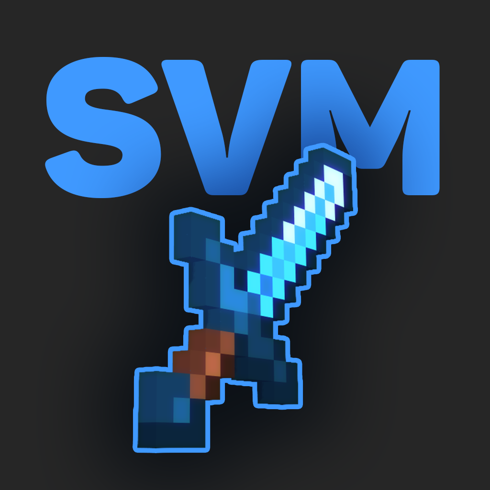

# Small View Model
Change the position, rotation and scale of your view model!

This mod uses the [ModMenu Mod](https://github.com/TerraformersMC/ModMenu) to change the settings.

## Versions
Currently, this fork is only available for Fabric 1.20.4. Refer to [the original repo by cosrnic](https://github.com/cosrnic/smallviewmodel) for older versions

 

